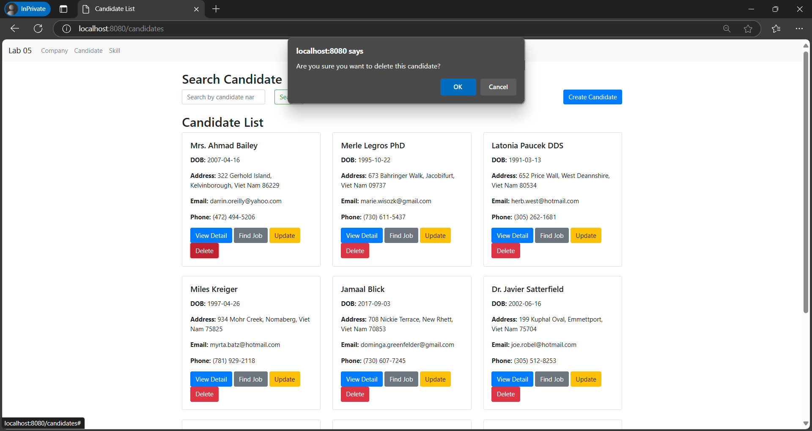
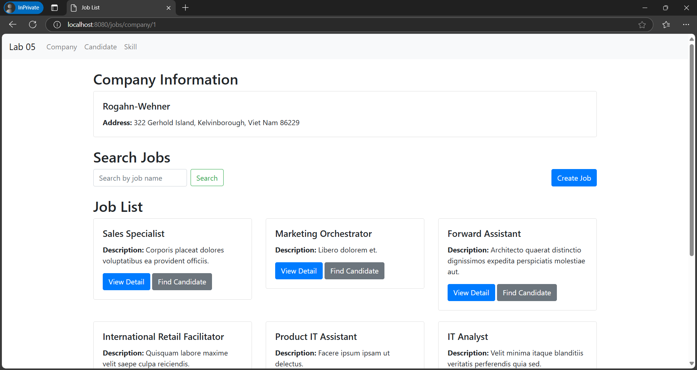

# Lab 05: Dự Án Web Spring Boot

Môn: Lập trình WWW (Java)

Giáo viên hướng dẫn: Võ Văn Hải

Sinh viên thực hiện: Trần Bình Trọng

MSSV: 20072511

- Báo cáo: 

##  Mục lục

- [Mở đầu](#mở-đầu)
- [Cài Đặt](#cài-đặt)
- [Cấu Trúc Dự Án](#cấu-trúc-dự-án)
- [Hướng Dẫn Sử Dụng](#hướng-dẫn-sử-dụng)
- [Hiện Thực](#hiện-thực)

## Mở đầu

Dự án này là một ứng dụng web được xây dựng bằng Spring Boot, với mục tiêu tạo ra một 
hệ thống quản lý ứng viên và công ty. Dự án này được thực hiện trong khuôn khổ của khóa 
học Lập trình WWW (Java). 

Mục tiêu của dự án này là tạo ra một hệ thống quản lý ứng viên và công ty, cho phép các 
công ty đăng tin tuyển dụng và các ứng viên có thể tìm kiếm và ứng tuyển vào các vị trí 
công việc phù hợp. 

## Cài đặt

1. Cài đặt Java JDK (phiên bản 11 trở lên).
2. Cài đặt Gradle.
3. Clone dự án từ GitHub: https://github.com/TronqTran/WWW_Java_HK1_24.git
4. Kết nối cơ sở dữ liệu: application.properties

## Cấu Trúc Dự Án

- src/main/java/vn/edu/iuh: Đây là đường dẫn chính cho mã nguồn Java của dự án.
    - backend: Chứa các thành phần của backend, bao gồm DTOs, enums, models, repositories, và services.
        - dtos: Chứa các lớp Data Transfer Object (DTO) dùng để truyền dữ liệu giữa các lớp.
        - enums: Chứa các enum dùng trong ứng dụng, như cấp độ kỹ năng.
        - models: Chứa các lớp mô hình đại diện cho các thực thể trong cơ sở dữ liệu.
        - repositories: Chứa các interface để truy cập dữ liệu từ cơ sở dữ liệu.
        - services: Chứa các lớp dịch vụ thực hiện logic nghiệp vụ.
    - frontend: Chứa các controller cho phần giao diện người dùng.
- src/main/resources: Chứa các file cấu hình và template cho ứng dụng.

## Hướng dẫn sử dụng

- Truy cập vào trang danh sách ứng viên: http://localhost:8080/candidates
- Truy cập vào trang danh sách công ty: http://localhost:8080/companies

## Hiện thực

Thực hiện các chức năng CRUD cho Candidate, Company, Skill.

Tìm các Công việc phù hợp cho từng Ứng viên.

Tìm các Ứng viên phù hợp cho từng Công việc.

- Danh sách Ứng viên: 
- Tìm Ứng viên: 
- Tạo Ứng viên: 
- Các Kỹ năng của Ứng viên: 
- Thêm Kỹ năng cho Ứng viên: 
- Tìm Việc cho Ứng viên: 
- Cập nhật Ứng viên: 
- Xóa Ứng viên: 
- Danh sách Công ty: 
- Danh sách Công việc của Công ty: 
- Danh sách Kỹ năng yêu cầu của một Công việc: 
- Tìm Ứng viên phù hợp cho công việc: 